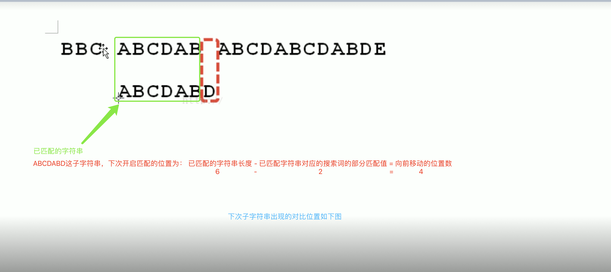

# data-struct-arithmetic

数据结构与算法的

1. 查找算法
   1.1 二分查找
   中间开始找，两边范围递归缩小查找；

1.2 斐波那契查找

===========查找算法==================================================================================

1. 二分查找struct

   1.1 binarySearch需求1

   a. 需求说明：
   查找数组，中目标元素的最大索引和最小索引？

   b. 思路分析：

   1. 使用二分查找，找到目标元素的index；
   2. 判断目标元素的index，左边或者右边是否还有相同的元素值；
   3. 如果有，则循环查到，直到不相等，记录此时的最大和最小索引，并退出；
      1.2 binarySearch需求2

   a. 需求说明：

   b. 思路分析：

   2. 斐波那契查找
   3. 插值查找
   4. 线性查找

   ===========排序算法==================================================================================

   1. 冒泡排序struct
   2. 快速排序struct

      2.1 QuickSort

      a. 思路分析

      1. 取出集合中的中的位置的元素middle，然后逐一拿两边的元素去和比较；
      2. 将大于元素middle的放到它的右边，将小于元素middle的放到它的左边；
      3. 取出元素middle到最左边元素的中间位置的元素middle2，按照上述2的方式比较；
      4. 同样，取出元素middle到最右边元素的中间位置的元素middle3，按照上述的方式比较；
      5. 递归循环上述 1、2、3、4步骤，直到最终的集合是一个有序的集合位置；

      b. 核心思想

      3. 插入排序struct

         3.1 insertSearch

         a. 思路分析

         1. 升序排序
         2. 将无序的数组arr，看成两个数组，一个是有序的数组，和一个是无序的数组；
         3. 将无序的数组，不断的向有序的数组中插入；
         4. 在每次插入的时候，要进行比较，若是升序，则将小放到前面，大的放到后面
         5. 在比大小的过中，使用的是移动的方式，将元素按顺序放入，而不是交换的方式

         b. 核心思想

         1. 将后面的数据，不断的向前插入，比较大小后，若没有找到合适的位置，需要将前面的数据先向后后移；
         2. 数据元素比较过程中，采用的不是交换的思路，而是移动的思路；
         3. 希尔排序struct
         4. 归并排序struct

            5.1 mergeSort

            a. 思路分析

            1. 先将集合从中间分成两部分A和B，然后再将A和B各自再分成两端A1 A2 和 B1 B2；
            2. 依次按照上面的方法，递归拆分 ,完成分的过程 ，终止条件为left >= right；
            3. 完成1、2 步骤后，然后进行排序合并，此时是需要初始一个临时数组tmp = new int[];
            4. 如果是要进行升序排序，则再进行两个部分比较的时候，是将数值小的部分放到tmp数组中，大的数值在继续和另一部分
               的下一个元素进行比较；
            5. 每完成一轮比较，都要将
            6. 基数排序
            7. 选择排序
               ===========数据结构==================================================================================
         5. 数组
         6. 集合
         7. 哈希表
         8. 链表
         9. 队列
         10. 栈
         11. 树
         12. 堆

         ===========经典算法==================================================================================

         1. KMP算法
            1.1 解决子字符串str2 在主字符串str1中找到完全可匹配到的位置的低复杂度计算

            String str1="BBC ABCDAB ABCDABCDABDE";
            String str2="ABCDABD";
            一般解决方法是字符暴力匹配，用str2与str1每一位字符匹配复杂度为O(m*n)；

            

            

            

            算法方法通常采用如下KMP算法，即匹配过得，就不再匹配了，则复杂度为O(m+n)；

            

            

            1.2 间接的推到原理

            a. 字符串前缀、后缀的概念

            

            b. 部分匹配表推导

            部分匹配值就是“前缀”和“后缀”的最长的共有元素的长度，以“ABCDABD”为例，

            

            最终得到的部分匹配值表如下，其中ABCDABD为“搜索词”，0000120为“部分匹配值”，具体使用，

            匹配到了A，则部分匹配值为0；
            匹配到了AB, 则部分匹配值为0；
            匹配到了ABC, 则部分匹配值为0；
            匹配到了ABCD, 则部分匹配值为0；
            匹配到了ABCDA, 则部分匹配值为1；
            匹配到了ABCDAB, 则部分匹配值为2；
            匹配到了ABCDABD, 则部分匹配值为0；

            

            1.3 核心计算公式
            a. 部分匹配表的生成： 搜索词+部分匹配值。是通过大量的观察和计算后，通过一定的规则方法计算得到；
            b. 使用部分匹配表完成KMP匹配： 已匹配的字符串长度 - 已匹配的字符串对应搜索词的部分匹配值 = 向前移动的位置次数.

            eg:

            
